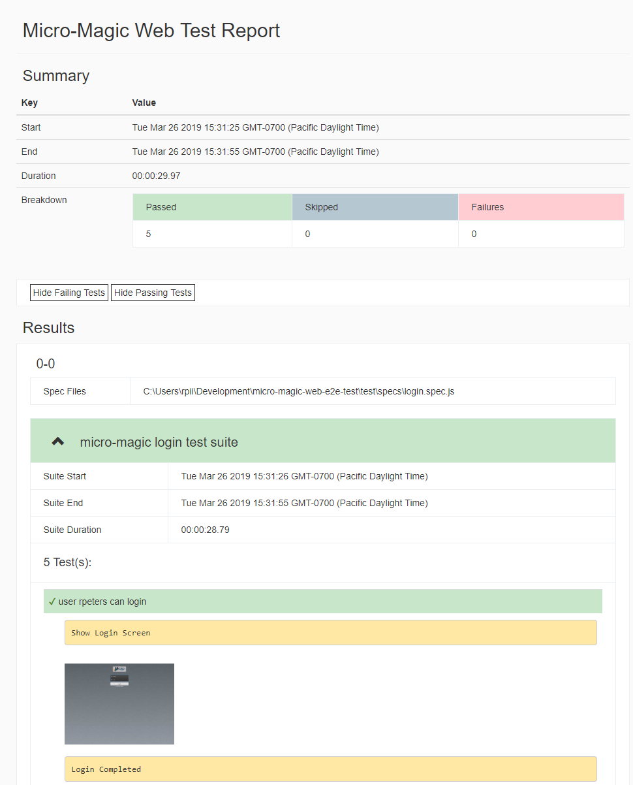

 # wdio-html-nice-reporter

A reporter for webdriver.io which generates a nice HTML report.  
The name is silly but provides integration with webdriverio

Compatible with webdriverio version 7.7 and up
### Bug fix:  webdriverio was shutting down in the middle of json async write.
Note: if you are not getting your report generated in the cucumber or jasmine test runners, you can add the following to package.json scripts and generate the report this way after the test completes :
```
    "report": "node node_modules/wdio-html-nice-reporter/lib/makeReport.js master-report.html 'reports/html-reports/'",
```
If you do this you do not need to create a ReportAggregator in your wdio.config.ts
### Bug fix:  json write wasnt awaited for correctly

### Great new improvement:  no more out of memory errors due to json.stringify

### Great new feature:  take videos of each test


## [Changelog](https://github.com/rpii/wdio-html-reporter/blob/master/changes.md)

## Information

This project is a rewrite of [@rpii/wdio-html-reporter](https://www.npmjs.com/package/wdio-html-reporter)
It is written in typescript with many enhancements.


### Duplicate Types NOTE:

The problem below is in NOT latest  version of npm and yarn!!!

if you use an old npm install, you can have duplicate types installed.  yarn does not have this issue.

For a typescript compile in your test project you may have to add the script below to your package.json and rerun the npm install if you are getting duplicate types.

Add to devDependencies:

"@wdio/types": "^7.8.0",

Add to scripts:

    "postinstall": "rimraf -rm node_modules/wdio-html-nice-reporter/node_modules/@wdio/types"


## Configuration

### WDIO.config.ts

The following code shows the default wdio test runner configuration. Just add an HtmlReporter object as another reporter to the reporters array:

### A functioning wdio.config.ts is provided in the [/samples/wdio.config.ts](/samples/wdio.config.ts)

below are snippets from that file.

```typescript

// wdio.config.ts
import {ReportGenerator, HtmlReporter} from 'wdio-html-nice-reporter';
let reportAggregator: ReportGenerator;

const BaseConfig: WebdriverIO.Config = {
    
  reporters: ['spec',
        ["html-nice", {
            outputDir: './reports/html-reports/',
            filename: 'report.html',
            reportTitle: 'Test Report Title',
            linkScreenshots: true,
            //to show the report in a browser when done
            showInBrowser: true,
            collapseTests: false,
            //to turn on screenshots after every test
            useOnAfterCommandForScreenshot: false,

            //to initialize the logger
            LOG: log4j.getLogger("default")
        }
        ]
    ]
    
 
};
```
## Configuration Options:
  
### To generate a master report for all suites

webdriver.io will call the reporter for each test suite.  It does not aggregate the reports.  To do this, add the following event handlers to your wdio.config.js

Add to browser config file:
```
let reportAggregator : ReportAggregator;
```
Add to browser config object:
```javascript
    onPrepare: function (config, capabilities) {

    reportAggregator = new ReportGenerator({
        outputDir: './reports/html-reports/',
        filename: 'master-report.html',
        reportTitle: 'Master Report',
        browserName: capabilities.browserName,
        collapseTests: true
    });
    reportAggregator.clean();
}


onComplete: function (exitCode, config, capabilities, results) {
    (async () => {
        await reportAggregator.createReport();
    })();
}


``` 
### To use a logger for debugging

A new feature for developers is to add a log4js logger to see detailed debug output.  See the test/reporter.spec.js for configuration options.
If you dont want to use the logging, include in your project @log4js-node/log4js-api and you can quiet all debugging.
via:

    const log4js = require('@log4js-node/log4js-api');
    const logger = log4js.getLogger(this.options.debug ? 'debug' : 'default');
 

  
### To generate a pdf file from this report

Requires an additional plugin to keep the support lightweight for those that dont want it.
see [@rpii/wdio-html-reporter-pdf](https://www.npmjs.com/package/@rpii/wdio-html-reporter-pdf)


## Sample Output:



## browserName

This must be set manually.  Its not available at config time since the browser object doesnt exist until you start a session.


