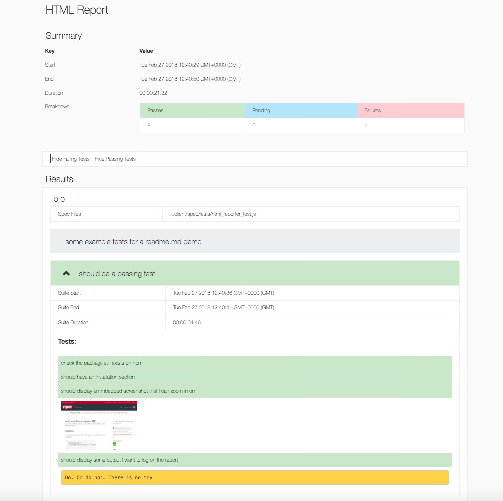

# wdio-html-format-reporter
A reporter for webdriver.io which generates a HTML report.
Based off the excellent [wdio-spec-reporter](https://www.npmjs.com/package/wdio-spec-reporter)

## Installation

The easiest way is to keep the `wdio-html-format-reporter` as a devDependency in your package.json:

```javascript
{
  "devDependencies": {
    "wdio-html-format-reporter": "~0.2.7"
  }
}
```

Or, you can simply do it with:

```
npm install wdio-html-format-reporter --save-dev
```


## Configuration
The following code shows the default wdio test runner configuration. Just add 'html-format' as another reporter to the array:

```javascript
// wdio.conf.js
module.exports = {
  // ...
  reporters: ['spec', 'html-format'],
  reporterOptions: {
    htmlFormat: {
      outputDir: './reports/'
    },
  },
  screenshotPath: `./screenShots`,     
  // ...    
};
```

## Example test
```javascript
const assert = require('chai').assert
const fs = require('fs-extra')
const dateFormat = require('dateFormat')

describe('some example tests for a readme.md demo', () => {
  describe('should be a passing test', () => {
    it('check the package still exists on npm', () => {
      browser.url("https://www.npmjs.com/package/wdio-html-format-reporter")
      const expectedTitle = 'wdio-html-format-reporter'
      assert.equal(browser.element('.package-name').getText(), expectedTitle, `The page title doesn't equal ${expectedTitle}`)
    })

    it('should have an installation section', () => {
      assert.isOk(browser.element('#user-content-installation').isVisible())
    })

    it('should display an imbedded screenshot that I can zoom in on', () => {
      browser.saveScreenshot(`${browser.options.screenshotPath}/screenshot-example.png`)
    })

    it('should display some output I want to log on the report', () => {
      // runner:logit is a custom event listener
      // It will you to output plain text to the HTML report
      process.send({
        event: 'runner:logit',
        output: 'Do. Or do not. There is no try'
      })
    })
  })

  describe('should have a failing test', () => {
    it('should have an configuration section', () => {
      assert.isOk(browser.element('#user-content-configuration').isVisible())
    })

    it('keywords should include "html"', () => {
      assert.match(browser.element('//h3[text()="Keywords"]/following-sibling::p[contains(@class, "list-of-links")]').getText(), /html/, '"html" is not one of the keywords')
    })

    it('keywords should include "spec"', () => {
      assert.match(browser.element('//h3[text()="Keywords"]/following-sibling::p[contains(@class, "list-of-links")]').getText(), /spec/, '"spec" is not one of the keywords')
    })

    it('keywords should include "wdio"', () => {
      assert.match(browser.element('//h3[text()="Keywords"]/following-sibling::p[contains(@class, "list-of-links")]').getText(), /wdio/, '"wdio" is not one of the keywords')
    })
  })
})

describe('Full page screenshot', () => {
  it('should open wateraid.org', () => {
    browser.url('https://www.wateraid.org/')
  })

  it('should take full page screenshot using wdio-screenshot', () => {
    // runner:logit is a custom event listener
    // It will you to output plain text to the HTML report
    process.send({
      event: 'runner:logit',
      output: 'great plugin for fullscreen screenshots: https://www.npmjs.com/package/wdio-screenshot'
    })

    const timestamp = dateFormat(new Date(), "yyyymmddHHMMss");
    const filepath = `${browser.options.screenshotPath}/${browser.session().sessionId}/${timestamp}`

    // using wdio-screenshot
    browser.saveDocumentScreenshot(`${filepath}.png`);

    // screenshot:fullpage is a custom event listener
    // It prevents having to take a normal screenshot in order to trigger runner:screenshot
    // then taking a second fullpage screenshot and overwriting the file
    process.send({
      event: 'screenshot:fullpage',
      filename: `${filepath}.png`
    })
  })
})

```

[Report Example: wdio-report.html](https://cdn.rawgit.com/aruiz-caritsqa/wdio-html-format-reporter/master/wdio-report.html)




## Output
The default output is to `./wdio-report.html`

## TODO:
- ~~Make the output file configurable~~
- ~~Convert images to JPG before embedding~~
- Better filtering options
- Reduce height of suite headers
- Make sure it works with Jasmine tests
- Pie chart?
